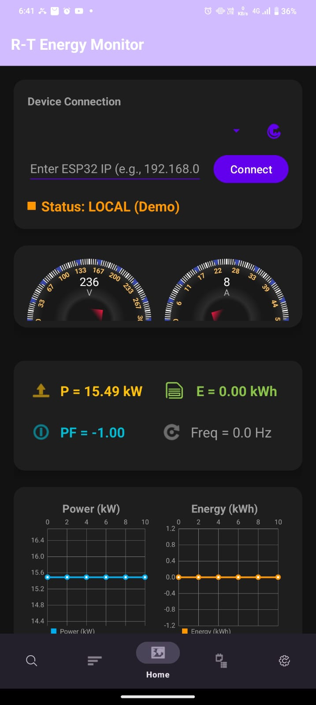

# ⚡ R-T Energy Monitor & RT AI Assistant

## ✨ Overview
The **R-T Energy Monitor** is a sleek mobile app for **Real-Time Energy Monitoring** and **Intelligent Energy Management**.  
Track your energy usage, optimize consumption, and get AI-powered insights — all in one app!

---

## 📱 Features

1. **Real-Time Energy Tracking**  
     

2. **AI Assistant for Energy Optimization**  
     

3. **Graphical Insights & Reports**  
     

4. **Notifications & Alerts**  
     

5. **User-Friendly Dashboard**  
     

6. **Settings & Customization**  
     

---

## 🚀 How It Works
1. Connect your devices.  
2. Monitor energy consumption in real-time.  
3. Get AI-powered recommendations for energy savings.  
4. View detailed charts and reports.  

---

## 🛠 Tech Stack
- **Android Studio** (Java/Kotlin)  
- **Firebase** (Authentication & Database)  
- **Room Database**  
- **AlarmManager & Notifications**  

---

## 📂 Links
- [Play Store / App Store](https://www.your-app-store-link.com)  
- [GitHub Repository](https://github.com/your-username/your-repo/releases)  

---

## ✅ Tips for Best Use
- Use **consistent image sizes** for a clean look.  
- Keep **feature descriptions short** and visual.  
- Add a **banner image** at the top for branding.  
- Update screenshots regularly to reflect new features.
